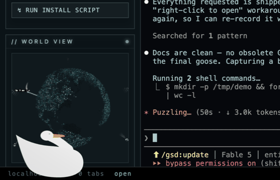

# Entitled Goose



A desktop pet for macOS (Windows beta): a goose — faithful in style to *that* goose —
that lives on your screen as a transparent overlay and acts like it owns the place.
It roams the whole desktop, honks with intent, judges you silently, knows what time
it is, and **closes your distracting tabs** (YouTube, Instagram, Amazon, …) by
walking to the close button and pecking it.

**Download:** [entitled-goose.vercel.app](https://entitled-goose.vercel.app) ·
[releases](https://github.com/SimonSaysGiveMeSmile/entitled-goose/releases)

> **Legal note:** Original art and audio only — the goose is drawn entirely in code
> (flat-vector canvas) and the honk is synthesized with Web Audio. Not affiliated
> with House House, Panic, or samperson's Desktop Goose. MIT licensed.

## What it does

- **Roams and waddles** anywhere on screen with a procedural gait (feet pin to the
  ground, weight-shift roll) and an elastic one-curve neck that tracks your cursor
  with saccadic bird-snaps.
- **The Entitlement Meter** — content → miffed → indignant → wrath. Ignoring it
  escalates honks, muddy footprints, judgmental stares, and speech-bubble
  complaints ("as per my last honk…").
- **Focus enforcement** — watches the frontmost tab/app; on a blocklisted site the
  goose sprints to the tab's close button, honks twice, pecks, and the tab closes.
  *"closed your youtube. you're welcome."* Blocklist is editable in the control panel.
- **Environmental awareness** — greets you by time of day, judges 2am work sessions,
  counts your absences to the minute, delivers battery warnings *at the battery
  icon*, remarks on CPU strain and theme changes, and (optionally) reminds you of
  calendar events. Each category has a toggle.
- **Play** — click to poke (offends it), hold ~1s to pet (appeases it), drag to
  carry it (it dangles, unimpressed; drop it from a height and it has words).
  Switch desktops and it sprints after you — it never disappears, including over
  fullscreen apps.
- **Grudge memory** — quit via the tray and the next launch opens with
  *"I noticed you tried to evict me. bold."*

## Control panel

**Double-click the goose**, or use the 🪿 menu-bar icon → *Control panel…*
Live mood meter · mute · polite (work-safe) mode · focus enforcement toggle ·
footstep sounds · goose size · **energy** (restless ↔ sleepy) · max frame rate
(30/60/120) · awareness toggles · **blocked websites & apps** · phrase editor ·
an Apologize button.

## Run from source

```bash
npm install
npm start        # macOS; the goose appears immediately
npm test         # rig-math unit tests
npm run dist     # build installers (mac DMG + Windows NSIS)
```

## Permissions (macOS)

- Overlay, honks, cursor tracking: **none needed**.
- Focus enforcement & battery-icon targeting: **Automation** permission
  (System Events + your browser) — macOS prompts on first use.
- Calendar reminders (off by default): Calendar automation permission.

## Architecture

- **Electron** static full-work-area NSPanel overlay — transparent, click-through
  except over the goose (with a failsafe), never moves, never steals focus.
  Rendering is canvas-only at up to 120 fps with full-frame clears (~1% CPU).
- **Original vector puppet**: code-drawn paths on a procedural rig — quadratic
  elastic neck, analytic 2-bone bird-knee legs, gait generator, keyframed honk
  timeline, additive breath/blink/tail layers. Palette and proportions per the
  research brief in `docs/DESIGN.md`.
- **Behavior**: weighted shuffle-deck task picker modulated by the Entitlement
  Meter, energy setting, time of day, and your presence; enforcement and
  environmental events preempt.

```
main/       Electron main: overlay window, tray, control panel, FocusWarden,
            EnvMonitor, CalendarWatcher, settings/blocklist storage
renderer/   canvas goose: draw, animator, behavior, bubble, audio (synth), vfx
shared/     pure rig math (gait, IK, keyframes) — unit-tested
site/       landing page (entitled-goose.vercel.app)
docs/       DESIGN.md research brief · demo.gif
```
